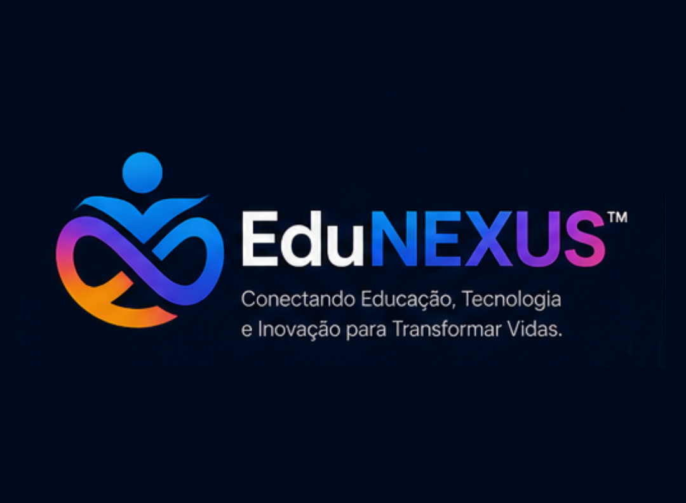

<!-- markdownlint-disable MD033 -->
<p align="center">
  
</p>

<h1 align="center">EduNEXUS</h1>

<p align="center">
  <strong>🌐 Conectando educação, acessibilidade e inovação digital.</strong>
</p>

<p align="center">
  <a href="#visão-geral">Visão Geral</a> •
  <a href="#principais-recursos">Recursos</a> •
  <a href="#tecnologias-utilizadas">Tecnologia</a> •
  <a href="#arquitetura-do-projeto">Arquitetura</a> •
  <a href="#estrutura-de-pastas">Estrutura</a> •
  <a href="#instalação">Instalação</a> •
  <a href="#acessibilidade">Acessibilidade</a> •
  <a href="#eduinsights">EDUINSIGHTS</a> •
  <a href="#roadmap">Roadmap</a>
</p>

<p align="center">
  
  
  
  
  
</p>

---

## 📌 Visão Geral

**EduNEXUS** é uma plataforma educacional **offline‑first**, projetada para funcionar como um **aplicativo nativo** diretamente no navegador. Ela reúne **apps educacionais**, **cursos interativos**, **tecnologia assistiva** e um **motor inteligente de descoberta (EDUINSIGHTS)** – tudo com foco em **inclusão digital** e **acessibilidade**.

> 🎯 **Propósito**  
> Democratizar o acesso a conteúdos e ferramentas educacionais de qualidade, especialmente em regiões com conectividade instável, garantindo que pessoas com deficiência possam utilizar a plataforma com autonomia.

---

## ✨ Principais Recursos

| Categoria | Funcionalidades |
|-----------|----------------|
| **📱 Catálogo de Apps** | Busca em tempo real, categorias, favoritos, badges (Novo/Beta/Atualizado), tela de detalhes com screenshots, tecnologias e changelog. |
| **🎓 Catálogo de Cursos** | Lista de cursos com thumbnails, barra de progresso, categorias, busca e botão “Continuar”. |
| **🎬 Player Premium** | Vídeo em destaque, playlist lateral com status de conclusão, materiais baixáveis (cards), estatísticas, anotações e modo foco. |
| **🧠 EDUINSIGHTS** | Card inteligente que mostra dicas contextuais, recomendações baseadas no histórico, incentivo ao uso de acessibilidade e chamadas para ação personalizadas. |
| **♿ Acessibilidade** | Leitor de tela integrado, alto contraste (WCAG AAA), fonte para dislexia, redução de animações, cursor ampliado, guia de leitura, modo baixa distração, comandos de voz e feedback sonoro. |
| **🌗 Temas Visuais** | Tema escuro (padrão), tema claro profissional, alto contraste escuro e alto contraste claro – todos independentes. |
| **💾 Offline First** | Service Worker avançado (cache‑first / stale‑while‑revalidate) e persistência local com IndexedDB. |
| **📱 Responsividade** | Mobile‑first, adapta‑se a smartphones, tablets, desktops e monitores ultrawide. |
| **📬 Central de Contato** | Links diretos para WhatsApp, Instagram, Telegram, YouTube e formulário de sugestões com validação. |
| **🔧 Painel Admin** | CRUD completo de apps, cursos e categorias – tudo salvo no IndexedDB (preparado para backend futuro). |

---

## 🛠 Tecnologias Utilizadas

| Tecnologia | Finalidade |
|------------|------------|
| **HTML5** | Estrutura semântica e acessível |
| **CSS3** | Glassmorphism, temas fluidos, responsividade (clamp, grid, flex) |
| **JavaScript (Vanilla ES2020+)** | Toda a lógica SPA, roteamento, player, acessibilidade e persistência |
| **Service Worker** | Cache estático/dinâmico, estratégias offline‑first |
| **Manifest Web App** | Instalação como PWA (ícones, start_url, tema) |
| **IndexedDB** | Persistência de progresso, favoritos, anotações, histórico e dados do admin |
| **localStorage** | Preferências simples (tema, acessibilidade, estatísticas) |
| **Web Speech API** | Leitor de tela (síntese) e comandos de voz (reconhecimento) |
| **Picture‑in‑Picture API** | Player flutuante |
| **Font Awesome 6** | Ícones vetoriais |
| **Google Fonts (Nunito)** | Tipografia principal |

---

## 🧱 Arquitetura do Projeto

- **Single Page Application (SPA)** – troca de rotas via hash (`#dashboard`, `#apps`, `#player`, etc.).
- **Router customizado** – mapeia URLs para funções de renderização, com transições suaves e proteção de rotas.
- **Estrutura modular** – cada tela é uma função (`renderDashboard`, `renderApps`, `renderPlayer`). Os módulos de persistência (`EduDB`, `EduStore`) e utilitários (`ErrorHandler`, `Sanitize`) são separados.
- **Offline‑first** – Service Worker com cache‑first para recursos estáticos e stale‑while‑revalidate para dados.
- **Progressive Enhancement** – funcionalidades como Picture‑in‑Picture e comandos de voz são adicionadas apenas quando suportadas pelo navegador.

---

## 📁 Estrutura de Pastas
/
├── index.html # Ponto de entrada principal
├── manifest.json # Configuração PWA
├── sw.js # Service Worker
├── assets/
│ ├── logo/
│ │ └── banner.png # Logo principal do projeto
│ ├── icons/ # Ícones do PWA (192x192, 512x512)
│ │ ├── icon-192.png
│ │ └── icon-512.png
│ ├── img/ # Screenshots e imagens de documentação
│ │ ├── dashboard.png
│ │ ├── apps.png
│ │ ├── courses.png
│ │ └── player.png
│ └── apps/ # Ícones e screenshots dos aplicativos
│ ├── labescritaai/icon.png
│ ├── labescritaai/screenshot1.webp
│ └── ...
├── css/
│ ├── styles.css
│ └── accessibility.css
├── js/
│ ├── app.js
│ ├── router.js
│ ├── data.js
│ ├── database.js
│ ├── store.js
│ ├── accessibility.js
│ ├── screenreader.js
│ ├── eduInsights.js
│ ├── recommendations.js
│ ├── native.js
│ ├── offline.js
│ ├── personality.js
│ ├── animations.js
│ ├── utils/
│ │ ├── sanitize.js
│ │ ├── errorHandler.js
│ │ └── validation.js
│ └── ...
└── admin/
├── index.html
├── admin.css
└── admin.js

text

> **Nota:** As imagens de screenshot (dashboard, apps, cursos, player) devem ser colocadas em `assets/img/`. Os ícones do PWA ficam em `assets/icons/`.

---

## 🚀 Instalação e Execução Local

1. **Clone o repositório**
   ```bash
   git clone https://github.com/Enocram/EduNEXUS.git
   cd EduNEXUS
Use um servidor local (obrigatório para Service Worker)

Com VS Code: instale a extensão “Live Server” e clique em “Go Live”.

Com Python:

bash
python -m http.server 5500
Com Node.js (npx):

bash
npx http-server -p 5500
Acesse http://localhost:5500 e aproveite.

⚠️ O Service Worker exige HTTPS ou localhost. Para testes em rede, use um domínio local configurado com HTTPS (ex: ngrok).

🌐 Como Publicar
GitHub Pages (não suporta Service Worker em modo completo devido a HTTPS, mas funciona para a interface)
Vá em Settings > Pages.

Selecione a branch main e a pasta / (root).

Acesse https://seuusuario.github.io/EduNEXUS/.

Netlify (recomendado – HTTPS + suporte a Service Worker)
Faça o deploy arrastando a pasta do projeto.

Configure as regras de redirecionamento (arquivo _redirects):

text
/* /index.html 200
Vercel (similar ao Netlify)
Conecte o repositório e faça o deploy automático.

Hospedagem própria (Apache/Nginx)
Certifique‑se de que o servidor entregue os arquivos com os cabeçalhos corretos e que o Service Worker seja servido da raiz.

Configure fallback para index.html em rotas não encontradas (SPA).

♿ Acessibilidade
O EduNEXUS foi construído seguindo as diretrizes WCAG 2.1 nível AAA (aplicado aos componentes essenciais). Os recursos incluídos são:

Recurso	Descrição
Leitor de tela integrado	Sintetiza o texto da página (SpeechSynthesis), com controles de velocidade, pausa e retomada. Destaque visual da frase sendo lida.
Navegação por teclado	Tab, Shift+Tab, Enter, setas, atalhos (espaço, F, N, T, Alt+R, Alt+V, Alt+A). Focus ring altamente visível.
Alto Contraste (WCAG AAA)	Fundo preto, texto amarelo, links ciano. Versão clara também disponível.
Fonte para Dislexia	OpenDyslexic (fallback), espaçamento entre letras e palavras aumentado.
Cursor ampliado	Cursor customizado com tamanho maior.
Guia de leitura horizontal	Linha semitransparente que segue o texto.
Modo baixa distração	Remove cabeçalho, navegação e sidebars.
Redução de animações	Remove todas as animações (respeita prefers-reduced-motion).
Comandos de voz (beta)	Navegue por comandos como “página inicial”, “cursos”, “apps”, “ler página”, “alto contraste”, “aumentar fonte”.
Feedback sonoro opcional	Beep curto para ações importantes.
Zoom inteligente	Layout fluido, sem quebras (viewport configurada).
🧠 EDUINSIGHTS – Motor de Descoberta Inteligente
O EDUINSIGHTS é um card contextual que aparece no Dashboard e em outras telas, exibindo mensagens personalizadas com base no comportamento do usuário.

Como funciona
Registra visitas aos apps, favoritos e uso de acessibilidade (armazenamento local via localStorage).

Exibe dicas sobre:

exploração da plataforma;

recursos de acessibilidade;

tecnologia assistiva;

solicitação de apps personalizados;

sugestões e contato.

Recomenda revisitar o último app acessado ou explorar novos conteúdos.

Permite atualizar o insight (botão “↻”) e clicar em ações sugeridas (ex: “Abrir” um app recomendado).

Exemplos de insights
💡 Explore os aplicativos disponíveis e descubra novas possibilidades para ensino e aprendizagem.

♿ Experimente os modos de acessibilidade disponíveis nas configurações.

🛠️ Precisa de um aplicativo educacional personalizado para sua instituição? Entre em contato!

↩️ Você visitou recentemente “AlphaMath IA”. Deseja acessá-lo novamente?

📱 Apps Disponíveis (exemplo)
Nome	Categoria	Descrição
LabEscritaAI	Educação	Analise seu texto, detecte fragilidades acadêmicas e evolua como escritor científico.
YES - Inglês com a Bíblia	Educação	Aprenda inglês enquanto estuda a Bíblia.
VivaLAÇO	Saúde	Suporte a pessoas com Alzheimer, focado em rotina, memória e conexão familiar.
Cobrei?	Finanças	Organize cobranças, acompanhe pagamentos e simplifique sua gestão financeira.
Teclado Virtual Acessível	Tecnologia Assistiva	Teclado na tela com previsão de palavras e teclas ampliadas.
A lista completa pode ser gerenciada pelo painel administrativo (/admin/index.html – senha admin123).

📚 Cursos Disponíveis
Curso	Categoria	Progresso (padrão)
IA na Educação Especial	IA	35%
Tecnologia Assistiva Avançada	Tecnologia Assistiva	10%
Design Inclusivo e Acessibilidade	Educação	20%
Neurociência e Aprendizagem	Educação	0%
Os cursos possuem módulos, aulas, materiais baixáveis e transcrição sincronizada.

🗺 Roadmap
Curto prazo (0‑3 meses)
✅ Implementar backend mínimo (Node.js + Express) com autenticação OAuth (Google, Microsoft).

✅ Background Sync para sincronizar ações offline (favoritos, anotações, progresso).

✅ Analytics integrado (tempo de estudo, cursos concluídos).

Médio prazo (3‑9 meses)
🤖 Recomendação por IA baseada no histórico do usuário.

🏆 Gamificação: pontos, rankings, certificados.

🛒 Marketplace de criadores (educadores publicam seus próprios cursos).

💬 Modo colaborativo: salas de estudo, discussões por aula.

Longo prazo (9‑18 meses)
📱 Aplicativo nativo (React Native) usando a mesma base PWA (webview).

🔗 Integração com LTI (Learning Tools Interoperability) para LMS externos.

🌍 Realidade aumentada (WebXR) para aulas práticas.

🧠 Assistente virtual com IA (chat integrado).

📸 Capturas de Tela
<div align="center">     </div>
As imagens devem ser adicionadas em assets/img/. Enquanto isso, você pode testar o projeto localmente.

🤝 Contribuições
Contribuições são bem‑vindas! Sinta‑se à vontade para:

Reportar issues (bugs, melhorias).

Enviar pull requests com correções ou novas funcionalidades.

Sugerir ideias via e‑mail ou pela Central de Contato.

Como contribuir
Faça um fork do projeto.

Crie uma branch para sua feature (git checkout -b feature/nova-coisa).

Commit suas alterações (git commit -m 'feat: adiciona nova funcionalidade').

Push para a branch (git push origin feature/nova-coisa).

Abra um Pull Request neste repositório.

📄 Licença
Este projeto está licenciado sob a MIT License – veja o arquivo LICENSE para detalhes.

👤 Autor
Marcone Arruda
Pedagogo, escritor, desenvolvedor de produtos educacionais digitais e criador do EduNEXUS.

https://img.shields.io/badge/GitHub-marconearruda-181717?style=flat-square&logo=github
https://img.shields.io/badge/Instagram-@marconearruda-E4405F?style=flat-square&logo=instagram
https://img.shields.io/badge/Email-contato@edunexus.com-D14836?style=flat-square&logo=gmail
https://img.shields.io/badge/WhatsApp-(84)%252098816%E2%80%914322-25D366?style=flat-square&logo=whatsapp
https://img.shields.io/badge/Website-edunexus.com-4285F4?style=flat-square&logo=google-chrome

<p align="center"> Feito com 💜 por <strong>Marcone Arruda</strong> e a comunidade EduNEXUS. </p> ```